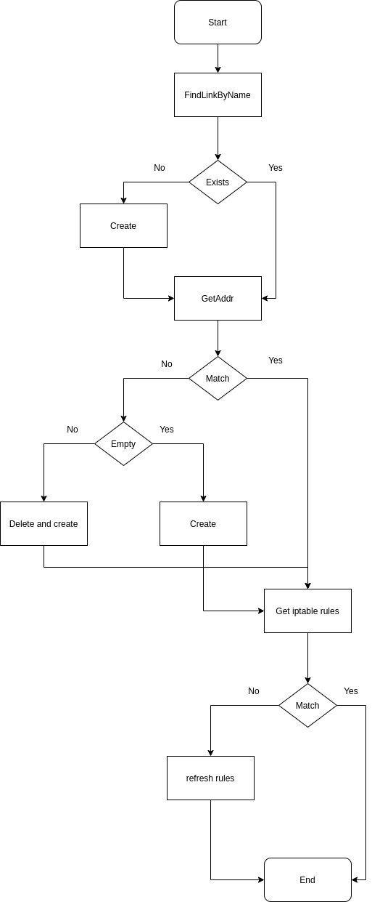
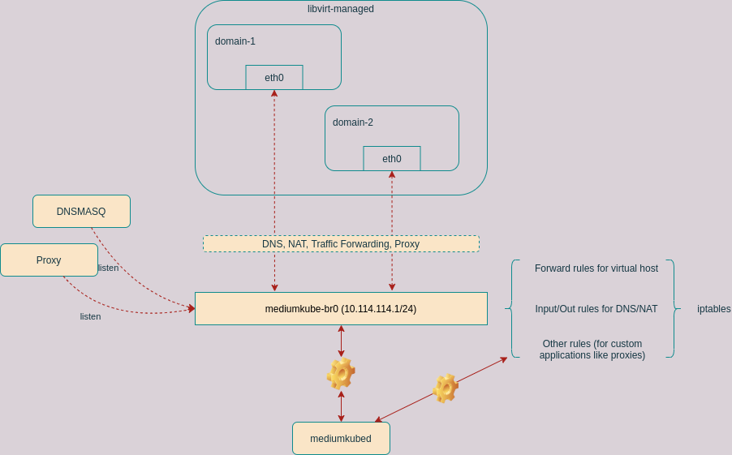

# MediumKubed

MediumKubed is daemon for mediumkube. This is introduced to support `libvirt` backend. 

## What does mediumkubed does?
- Maintain a virtual bridge network
- Monitor and configure virtual bridge
- Other tasks 


## How does it work?

In order to make out system working, it is preferred that we can have a virtual network controlled by mediumkube. Therefore we introduce a daemon called `mediumkubed`, that automatically configures virtual network and iptable entries for us. The logic of `mediumkubed` is like this 



## Network Topology

The network topology looks like this 


## Profiling

`mediumkubed` accepts `-p` and `-pport` flags. If `-p` is enabled, it starts a web server on port `7777` by default, then you can do

```bash
$ curl localhost:7777/debug/pprof/profile > profile && go tool pprof profile
```

to analyze the CPU usage